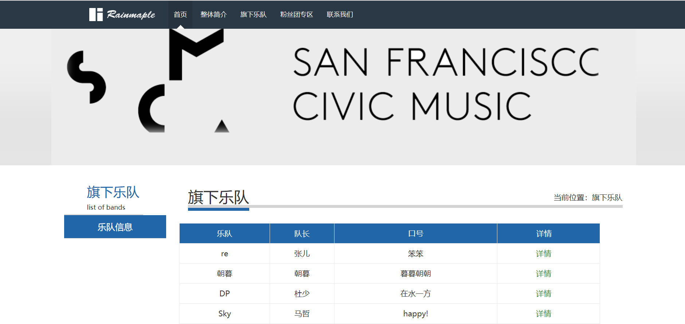
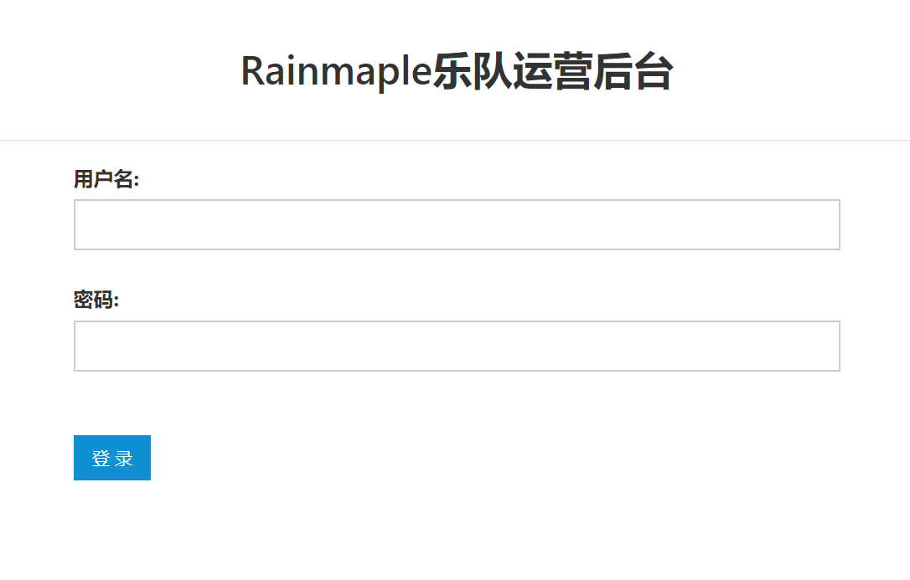

### 这是一个数据库课程设计完成的作品
名字叫做Rainmaple乐队管理系统

#### 首页各种权限用户均可查看
- 简单的轮播

- 旗下的乐队信息(从数据库中读取)

- 后台入口

- 简易的登录界面

- 根据账号类型实现权限控制

- 队长可对队员的信息进行修改

- 点击添加乐队成员（模态框的修改方式）

### 主要采用的MVC设计模式，界面所用框架为AmazeUI，数据库采用的是MySQL
- 权限方面采用的权限表进行权限管理，并添加触发器对权限操作进行管理
